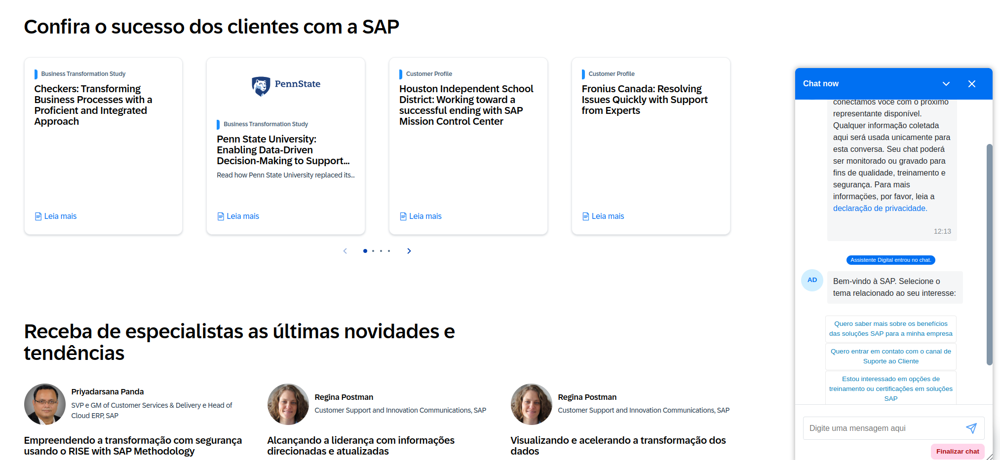
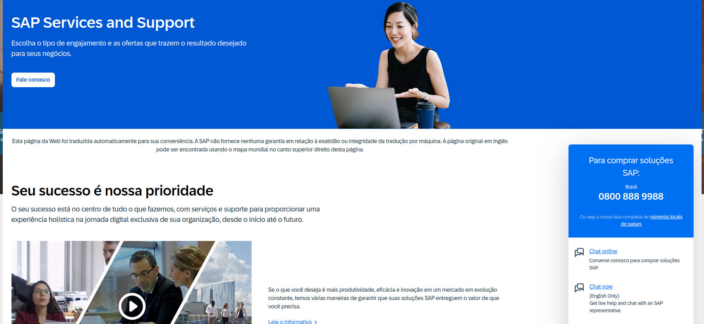
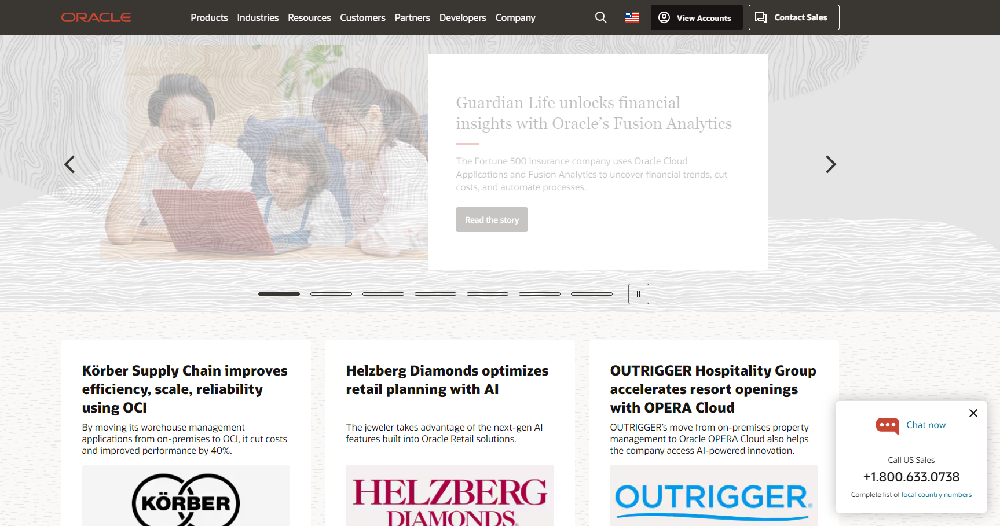
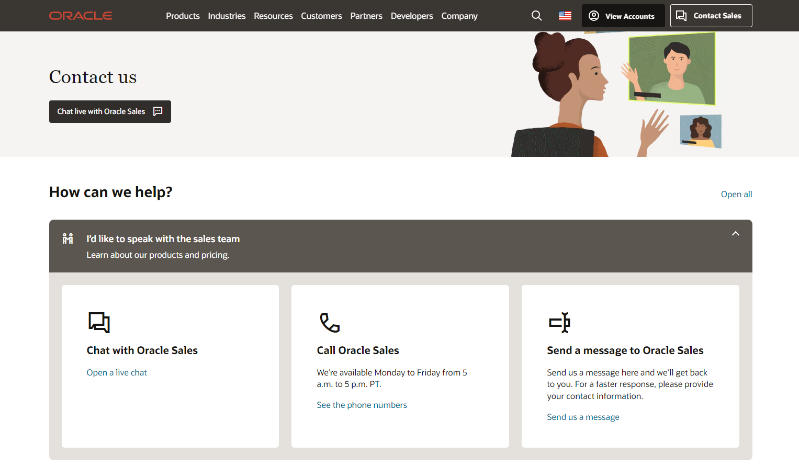
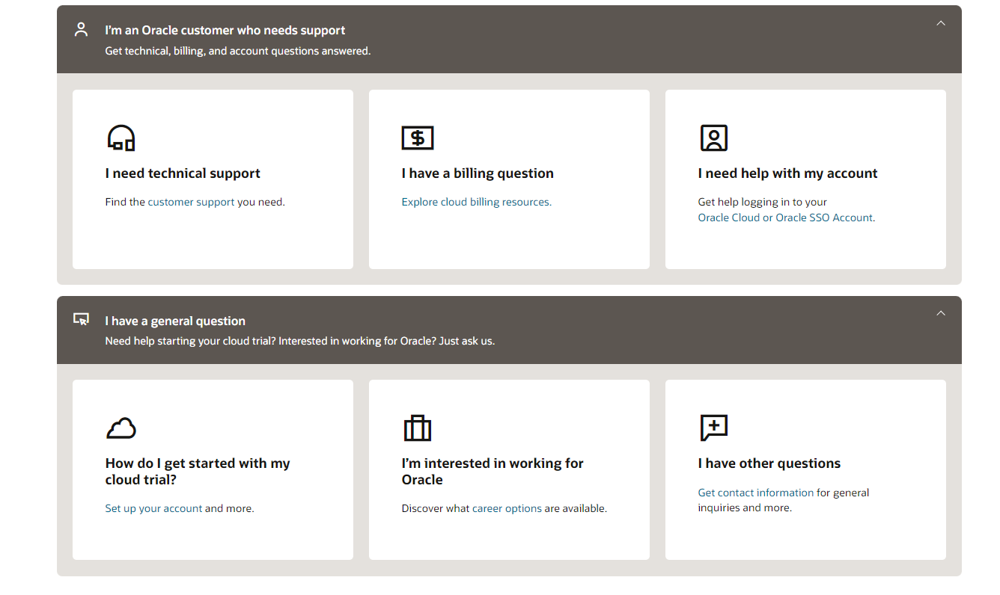
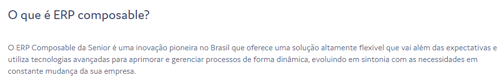
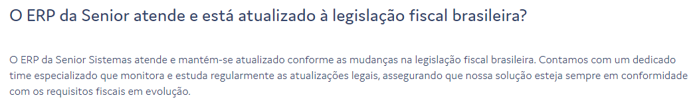
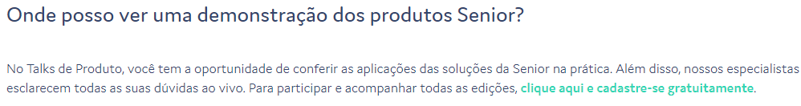
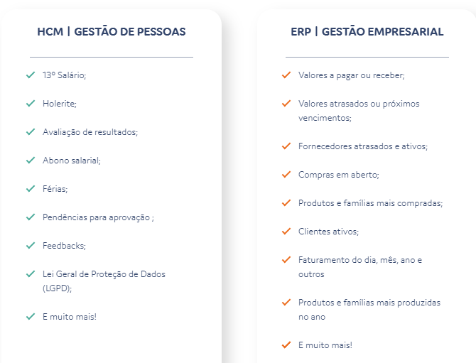
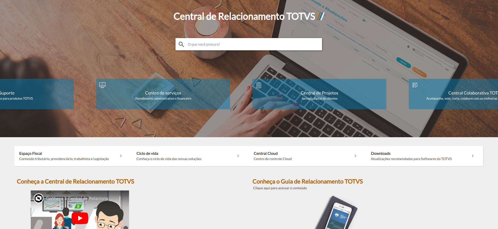

# Pesquisa de Modelos Comunicação e FAQ's entre as Principais Empresas no Setor de Sistemas Corporativos ERP e Seus Clientes

<!-- Resultados esperados:
    - Uma lista curada com as principais empresas e seus sistemas
    - Descrição dos modelos de comunicação e dados das empresas e seus sistemas
    - Exemplos de comunicação e de dados
-->

1.SAP (Alemanha)

# SAP

[Website](sap.com/brazil/)

[SAP Services Support](https://www.sap.com/brazil/services-support.html)

Tipos de interação com o cliente:

- Fale Conosco (contact form)
- Chat Online (chatbot, solicita dados de contato)
- Página exclusiva para treinamentos (guias, vídeos, grupos, webinars) [link](https://learning.sap.com/)
- Rede Social/Comunidade para interação entre usuários [link](https://community.sap.com/)
- Extensivos tutoriais, vídeos, documentações, artigos de blog e chats para diferentes tópicos e produtos.
- [FAQs Page](https://community.sap.com/t5/help/faqpage)
- [Q&A - Questions & Answers](https://community.sap.com/t5/what-s-new/asking-and-answering-questions-in-the-community-after-migration/ba-p/311224)

2. Oracle (EUA)

## Oracle

- **Nome Comercial:** Oracle ERP Cloud
- **Site:** [Oracle](https://www.oracle.com/)

No site eles oferecem páginas sobre o produto oferecido e conteúdos para aprender sobre.

**Descrição dos Modelos de Comunicação e Dados:**

**Modelos de Comunicação:** Oracle ERP Cloud oferece interfaces web, aplicativos móveis, e APIs RESTful. A comunicação é reforçada por assistentes digitais e chatbots (Oracle Sales) baseados em IA: [Contato Oracle](https://www.oracle.com/corporate/contact/)

Também é oferecido chats separados para quem já é cliente:

**Exemplos de Comunicação e Dados:** APIs para gestão de cadeia de suprimentos, finanças, e projetos. Utilização de dashboards interativos para visualização de KPIs.

O site da senior possui algumas possibilidades para exploração sendo elas as seguintes:

Selecionando a Opção do ERP caimos nesta página [ERP Page](https://www.senior.com.br/solucoes/erp-gestao-empresarial) 
que mostra os eguintes itens:
- Funcionalidades
- Melhoras nas área de Atuação
- Empresas Parceiras
- Seção de Perguntas e Respostas
    - Exemplos:

    
    
    

O que pode ser feito com a IA da empresa:
 

- Está IA também Aparenta ter a possibilidade de ser consultada por WhatsApp

3. TOTVS (Brasil)

 # TOTVS

Tipos de interação com o cliente:
- Vendas por whatsapp
- Ligação para o cliente
- Materiais informativos (artigos e tutoriais)
- Blog
- [FAQ](https://www.totvs.com/sistema-de-gestao/)
- [Suporte técnico e de serviços](https://totvscst.zendesk.com/hc/pt-br/#home) (requer login) 

<!--
3. Microsoft (EUA)
4. Infor (EUA)

6. Sage (Reino Unido)
7. Workday (EUA)
8. NetSuite (EUA)
9. Epicor (EUA)
10. IFS (Suécia)
11. Unit4 (Países Baixos)
12. QAD (EUA)
13. Deltek (EUA)
14. Sage Intacct (EUA)
15. Syspro (África do Sul)
16. Acumatica (EUA)
17. Odoo (Bélgica)
18. Infor M3 (EUA)
19. Ramco Systems (Índia)
20. Epicor Prophet 21 (EUA)
21. SENIOR (Brasil)

-->
