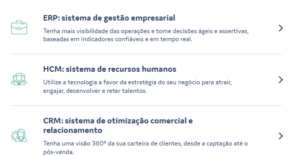
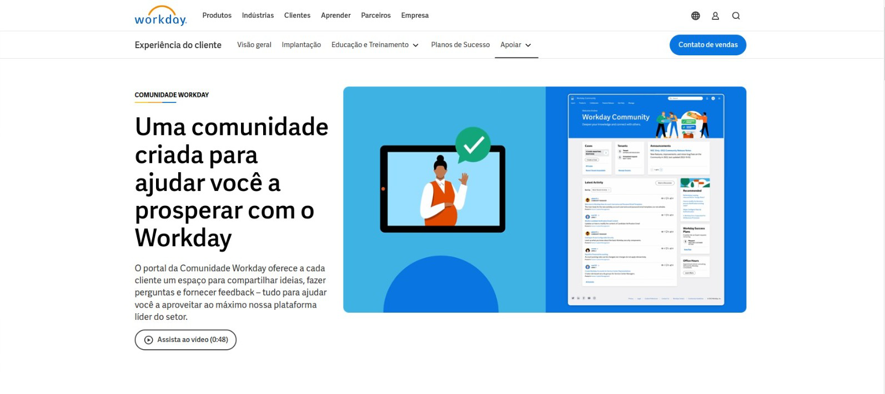

# Pesquisa de Modelos Comunicação e FAQ's entre as Principais Empresas no Setor de Sistemas Corporativos ERP e Seus Clientes

<!-- Resultados esperados:
    - Uma lista curada com as principais empresas e seus sistemas
    - Descrição dos modelos de comunicação e dados das empresas e seus sistemas
    - Exemplos de comunicação e de dados
-->

1.SAP (Alemanha)

## SAP

[Website](sap.com/brazil/)

[SAP Services Support](https://www.sap.com/brazil/services-support.html)

Tipos de interação com o cliente:

- Fale Conosco (contact form)
- Chat Online (chatbot, solicita dados de contato)
- Página exclusiva para treinamentos (guias, vídeos, grupos, webinars) [link](https://learning.sap.com/)
- Rede Social/Comunidade para interação entre usuários [link](https://community.sap.com/)
- Extensivos tutoriais, vídeos, documentações, artigos de blog e chats para diferentes tópicos e produtos.
- [FAQs Page](https://community.sap.com/t5/help/faqpage)
- [Q&A - Questions & Answers](https://community.sap.com/t5/what-s-new/asking-and-answering-questions-in-the-community-after-migration/ba-p/311224)

2. Oracle (EUA)

## Oracle

- **Nome Comercial:** Oracle ERP Cloud
- **Site:** [Oracle](https://www.oracle.com/)

No site eles oferecem páginas sobre o produto oferecido e conteúdos para aprender sobre.

**Descrição dos Modelos de Comunicação e Dados:**

**Modelos de Comunicação:** Oracle ERP Cloud oferece interfaces web, aplicativos móveis, e APIs RESTful. A comunicação é reforçada por assistentes digitais e chatbots (Oracle Sales) baseados em IA: [Contato Oracle](https://www.oracle.com/corporate/contact/)

Também é oferecido chats separados para quem já é cliente:

**Exemplos de Comunicação e Dados:** APIs para gestão de cadeia de suprimentos, finanças, e projetos. Utilização de dashboards interativos para visualização de KPIs.

3. SENIOR

## SENIOR

[Website](https://www.senior.com.br/)

O site da senior possui algumas possibilidades para exploração sendo elas as seguintes:

Selecionando a Opção do ERP caimos nesta página [ERP Page](https://www.senior.com.br/solucoes/erp-gestao-empresarial) 
que mostra os eguintes itens:
- Funcionalidades
- Melhoras nas área de Atuação
- Empresas Parceiras
- Seção de Perguntas e Respostas
    - Exemplos:

    
    
    
- Também existe esta página que possue outras peguntas [Perguntas Frequentes](https://cliente.senior.com.br/#/faq)

O que pode ser feito com a IA da empresa:
 

- Está IA também Aparenta ter a possibilidade de ser consultada por WhatsApp

4. TOTVS (Brasil)

 ## TOTVS

Tipos de interação com o cliente:
- Vendas por whatsapp
- Ligação para o cliente
- Materiais informativos (artigos e tutoriais)
- Blog
- [FAQ](https://www.totvs.com/sistema-de-gestao/)
- [Suporte técnico e de serviços](https://totvscst.zendesk.com/hc/pt-br/#home) (requer login) 

5. Workday (EUA)

## Workday

- **Nome Comercial:** Gerenciamento Financeiro Workday
- **Site:** [Workday](https://www.workday.com/)

No site, é fornecido páginas detalhadas sobre os produtos e conteúdos para informar mais sobre os serviços oferecidos.

**Descrição dos Modelos de Comunicação e Dados:**

**Modelos de Comunicação:** O Workday oferece acesso via sites, aplicativos para celulares e APIs. Também é utilizados assistentes digitais e chatbots com inteligência artificial para ajudar os usuários.

Para os clientes existentes, há informações e recursos exclusivos:

**Exemplos de Comunicação e Dados:** Eles oferecem APIs para ajudar na gestão financeira, planejamento e análise de dados, e gestão de pessoal. Também utilizam painéis interativos para visualizar indicadores importantes.

6. UNIT4 (Países Baixos)

## UNIT4

[Website](https://www.unit4.com/)

Oferece: "Our integrated AI-powered solutions & next-gen platform enhance your people’s experience of work across finance, HR & projects. Configured for swifter onboarding & best practice, our pre-built industry models boost productivity, collaboration & resilience, while helping moderate spend."

Sistemas: 
- ERP: Enterprise Resource Planning
- HCM: Human Capital Management 
- FP&A: Financial  Planning & Analysis
- Financials by Coda
- S2C: Source-to-contract by Scanmarket
- Other Tecnologies

Informações Técnicas e Treinamento: 
- Downloads e Videos (demo videos, documents library)
- News and Media 
- Insights and analysys (Blogs, podcasts, webinars, reports)
- Apresenta empresas show cases

AI:
Unit4’s AI mission 
A modern platform to support the organization 
Finance: Enhancing accuracy, efficiency, and impactful analysis
Projects: Streamlining essential processes and optimizing resources
Procurement: Optimizing invoicing
HCM: Utilizing your people through better planning and skills tracking
User experience and human-centric approach 
	Using customer feedback and data 
	Better user journeys through virtual assistance
	Data privacy, security, and ethical considerations
	Challenges and future outlook
	
Comunicação com o Cliente:
[Página de contato](https://www.unit4.com/contact-us)
-Formulário (First Name, Last Name, Business Email, Jog Title, Company, Country, Additional information)
- ChatBot
- Call center (phone)

Suporte:
[Página de suporte](https://www.unit4.com/about-us/services/support)
- Community (forums, interação entre clientes e parceiros)
- Documentações, downloads
- Suporte direcionado (via login)

7. LINX (Brasil)

## LINX

[Website](https://www.linx.com.br/)

Oferece: 
A Linx possui mais de 50 soluções em ERP, PDV, digital, autoatendimento, delivery, entre outros, para ajudar você a transformar complexidade em resultado.
Empresa do grupo Stone Co, a Linx é especialista em tecnologia para o varejo e líder no mercado de software de gestão, com 45,6% de market share do varejo, conforme atesta o IDC.

Informações Técnicas e Treinamento: 
- Blog
- Podcast
- Formulário para receber conteúdos

Comunicação com o cliente:
- Formulário para falar com o time de vendas
- Área do cliente com suporte direcionado para: financeiro, suporte e colaborador (requer login)
- [Linx Share](https://share.linx.com.br/?_ga=2.203518096.1497493967.1721810349-15976272.1721810349): conteúdos atualizados
- [Perguntas frequentes](https://share.linx.com.br/?_ga=2.239351555.1497493967.1721810349-15976272.1721810349#popular) 
- [Linx digital](https://docs.linxdigital.com.br/) 
- Chat online (requer login)
- ChatBot

Suporte Técnico:
- Área de suporte por produto, direciona para opções call center, ou abertura de chamados (requer login)

<!--
3. Microsoft (EUA)
4. Infor (EUA)
6. Sage (Reino Unido)
7. Workday (EUA)
8. NetSuite (EUA)
9. Epicor (EUA)
10. IFS (Suécia)
12. QAD (EUA)
13. Deltek (EUA)
14. Sage Intacct (EUA)
15. Syspro (África do Sul)
16. Acumatica (EUA)
17. Odoo (Bélgica)
18. Infor M3 (EUA)
19. Ramco Systems (Índia)
20. Epicor Prophet 21 (EUA)
21. SENIOR (Brasil)

-->
