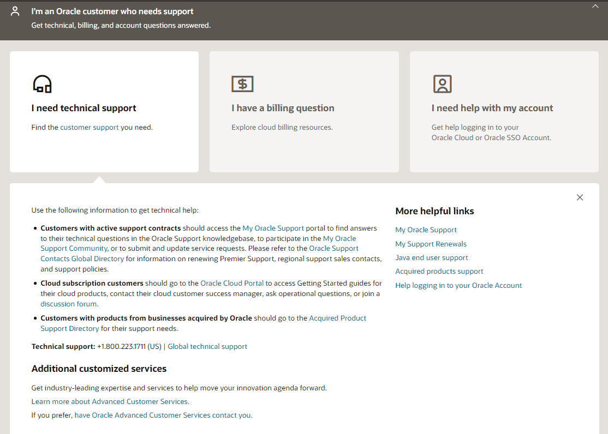
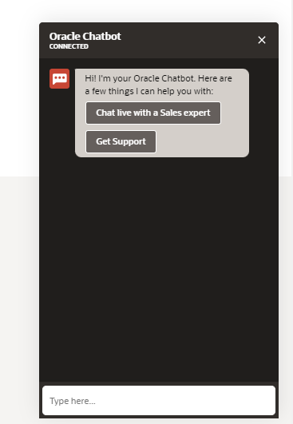
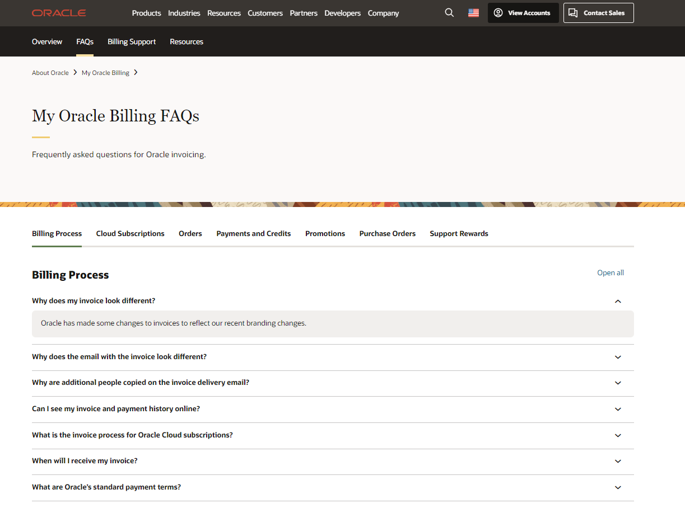
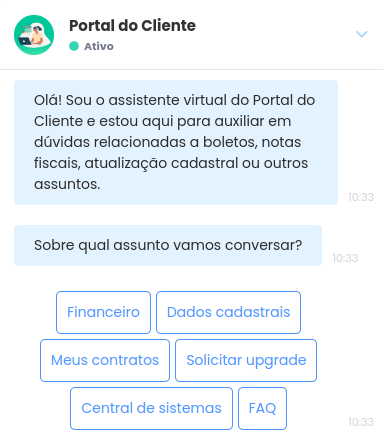
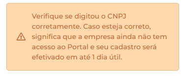
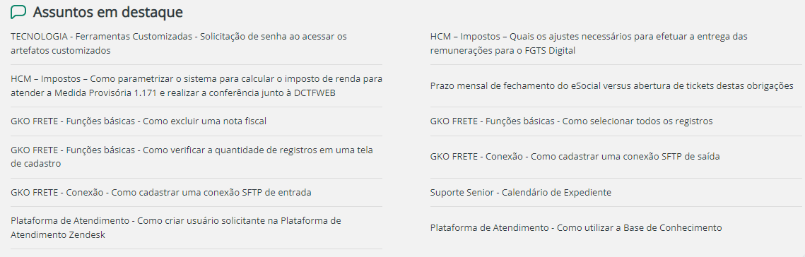

Pesquisa de Modelos de Q&A e Disponibilização de Informações Técnicas entre as Principais Empresas no Setor de Sistemas Corporativos ERP e Seus Clientes

<!--
Resultados esperados:

    Uma lista curada com as principais empresas e seus sistemas
    Descrição dos modelos de comunicação e dados das empresas e seus sistemas
    Exemplos de comunicação e de dados
-->

2.Oracle

# Oracle

É oferecido algumas opções de dúvidas para clientes e sugere o login na conta para acompanhar:

O chatbot entra em contanto, caso escolha a primeira opção:  

Também sugere olhar o FAQs com dúvidas recentes:

3. SENIOR

# SENIOR

Possuem um Bot na tela de login para sanar duvidas dos usurios

Para poder acessar o site do cliente é necessário criar uma conta com um CNPJ ou CPF(aparentemente)

Eles possuem de forma publica a sua political de Privacidade e a Politica de Cookies

Também é possível acessar um local onde possui alguns assuntos em destaque que aparentemente são duvidas de clientes respondidas através de artigos, também existem artigos sobre alguns erros que podem ocorrer na plataforma de como solucioná-los ou quando ele foi solucionado.

